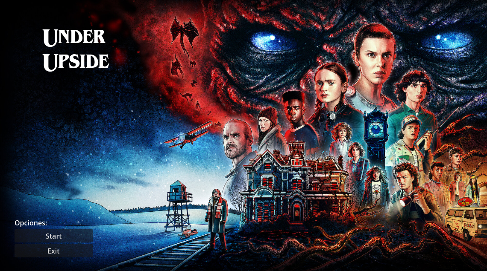

# UnderUpside

## Conceptualización

UnderUpside es un videojuego de plataformas en 2D con un giro innovador: la inversión de la gravedad. Inspirado en la temática de Stranger Things, el juego enfrenta al jugador a un mundo dividido en dos dimensiones: Upside y Under. La protagonista, una niña valiente, debe recorrer estas plataformas mientras recoge gorras y evita peligrosas criaturas como los Demogorgons y las manchas de oscuridad.

El juego está diseñado para partidas rápidas y desafiantes, con una dificultad progresiva que introduce nuevos retos conforme se avanza.

### Historia

La historia se centra en una niña atrapada en una dimensión paralela. En este mundo oscuro, la realidad está fragmentada en plataformas flotantes y dos planos de existencia. Para poder regresar a casa, debe recolectar las gorras dispersas en el entorno antes de que la "mancha" de oscuridad consuma todo a su paso. Sin embargo, los Demogorgons, guardianes de este mundo, intentan impedir su escape.

A medida que la protagonista avanza, la mancha se extiende, obligándola a actuar rápidamente. En los niveles más avanzados, la dificultad aumenta con enemigos más agresivos y caminos más complicados.

### Mecánicas de Juego

**Movimiento**: La protagonista puede moverse lateralmente y saltar para desplazarse entre plataformas.

**Inversión de Gravedad**: Cuando cae por debajo de y = 0, la gravedad se invierte y debe moverse en el Under, donde los controles se adaptan al nuevo entorno.

**Enemigos:**

- Demogorgons: Se mueven lateralmente sobre plataformas y en niveles avanzados pueden cambiar de plataforma.

- Manchas de Oscuridad: Son estáticas al inicio, pero se expanden con el tiempo, cubriendo todo el escenario.

**Objetivo**: El jugador debe recolectar todas las gorras antes de que la mancha cubra la totalidad del nivel.

**Dificultad progresiva**: A medida que el jugador avanza, los niveles se vuelven más desafiantes con menos tiempo, más enemigos y accesos más complejos.

### Público Objetivo

El juego está diseñado para niños y adolescentes, ofreciendo una experiencia desafiante pero accesible. Sus mecánicas sencillas lo hacen fácil de aprender, pero el aumento progresivo de dificultad proporciona un reto constante para los jugadores.

### Inspiración y Estilo Artístico

UnderUpside utiliza un estilo cartoon, con estos colores predominantes:

- Azules y claros en la parte Upside (parte superior del mundo)

- Rojos y negros en la parte Under (cuando la gravedad se invierte)

Los sprites y elementos visuales han sido editados a partir de imágenes retocadas con herramientas básicas.
