# UnderUpside

## Conceptualización

### Introducción
UnderUpside es un juego de plataformas en 2D con una mecánica única: la capacidad de cambiar la gravedad. 
Inspirado en el ambiente de Stranger Things, el jugador controla a una niña que navega entre dos dimensiones: el Mundo Real y UnderUpside. 
El objetivo es recolectar gorras mientras se esquivan enemigos como los Demogorgons y manchas oscuras en constante expansión. 
Diseñado para partidas rápidas y desafiantes, el juego incrementa su dificultad progresivamente
### Historia
La protagonista, una niña, descubre gorras misteriosas esparcidas por su mundo. 
A medida que las recoge, enfrenta a los Demogorgons y manchas oscuras. 
Un agujero en el suelo la lleva a UnderUpside, un mundo invertido donde la gravedad cambia y los enemigos son más agresivos. 
Para escapar, debe recolectar todas las gorras y desentrañar el secreto de Under antes de que la oscuridad lo consuma todo.

### Género
UnderUpside es un juego de plataformas en 2D que combina acción y aventura con mecánicas de cambio de gravedad. 
Ofrece una experiencia desafiante con elementos de suspenso y misterio, ideal para jugadores que disfrutan de juegos como Celeste o Hollow Knight.
### Público
El juego está dirigido a jugadores de 12 a 35 años que disfrutan de plataformas desafiantes, historias de misterio y mundos oscuros. 
Es apto para jugadores casuales que buscan partidas cortas pero intensas.

### Alcance
UnderUpside está diseñado para ser accesible en PC y consolas, con potencial para adaptarse a dispositivos móviles. 
Ofrece una experiencia rejugable con la posibilidad de expandirse mediante nuevos niveles y mecánicas en futuras actualizaciones.
Escalabilidad: Puede ampliarse con nuevos niveles, enemigos y mecánicas en futuras actualizaciones o DLCs.
Posible expansión: Si el juego tiene éxito, se podrían desarrollar secuelas o modos adicionales con nuevas mecánicas.

### StoryTime
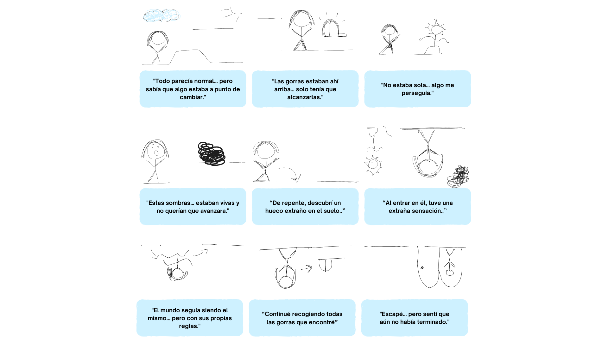

### Flujo del juego
El juego empieza con la niña en el suelo del mundo normal, donde tiene que moverse entre plataformas para recolectar gorras y evitar a los Demogorgons y las manchas de oscuridad. A medida que avanza, puede elegir ir hacia arriba, saltando entre plataformas para llegar a nuevas zonas con gorras, o bajar, donde todo se invierte y las plataformas están en el suelo. Al hacerlo, entra en UnderUpside, un mundo al revés donde la gravedad cambia y los enemigos siguen presentes, pero de forma diferente.
La jugadora puede alternar entre ambos mundos, el mundo normal y UnderUpside (el mundo invertido), para recolectar todas las gorras y escapar de las manchas que crecen con el tiempo. A medida que avanza, los enemigos se vuelven más rápidos y el espacio se hace más peligroso. El objetivo es recolectar todas las gorras, esquivar los enemigos y evitar que la oscuridad lo cubra todo, mientras el nivel se complica cada vez más.

### Personajes y objetos

**Eleven (Protagonista)**

Es una niña valiente y ágil. A lo largo del juego, debe enfrentarse a criaturas aterradoras y plataformas complicadas para recolectar gorras y encontrar una salida. Tiene una gran determinación para escapar, lo que la hace una protagonista resistente.
Posee 3 vidas al inciar la partida. Si pierde las 3 el juego termina

Habilidades:
- Saltos: Puede saltar entre plataformas en ambos mundos (normal y invertido) para acceder a zonas más altas o bajas.
- Velocidad: Se mueve rápidamente a una velocidad de 500 unidades por segundo.
- Cambio de dimensión: Puede entrar en el mundo invertido y cambiar su orientación

**Demogorgon (enemigos dinámicos)**

Son criaturas monstruosas que patrullan los dos mundos, buscando a Eleven para atraparla
Habilidades:

- Se mueven sobre una plataforma (en UnderUpside su velocidad se duplica)
- Si tocan a Eleven, le restan una vida

**Mancha (enemigos estáticos)**

Las manchas de oscuridad son áreas negras que se expanden gradualmente por el nivel. Si Eleven entra en contacto con ellas, pierde una vida. Las manchas están presentes en ambos mundos, lo que aumenta el desafío.
Habilidades:
- Expansión: Las manchas se expanden con el tiempo, reduciendo el espacio seguro para moverse.
- Estáticas: A diferencia de los Demogorgons, las manchas no se mueven, pero ocupan áreas grandes y son difíciles de evitar.

**Gorras**

Las gorras son el principal objetivo del juego. Están dispersas por los niveles, tanto en el mundo normal como en el invertido.
Funcionalidad:
- Cantidad: Se requiere una cantidad mínima de gorras para completar un nivel, pero siempre hay más gorras escondidas en cada mapa para obtener más puntos.
- Puntos: Cada gorra que se recoge otorga puntos.
- Objetivo: Al recolectar todas las gorras de un nivel, la jugadora puede desbloquear el siguiente nivel.

### Movimientos y físicas

- **Interacciones**
    Colisiones:

        Personaje - Escenario
        Demogorgon - Escenario
        Personaje - Demogorgon
        Personaje - Mancha
        Personaje - Gorra

- Controles
  
        Avanzar : teclas derecha e izquierda
        Saltar : Barra espaciadora

### Interfaz

- **Diagrama de flujo**

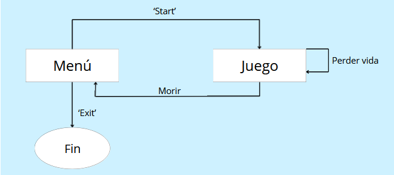

- **Menú**

  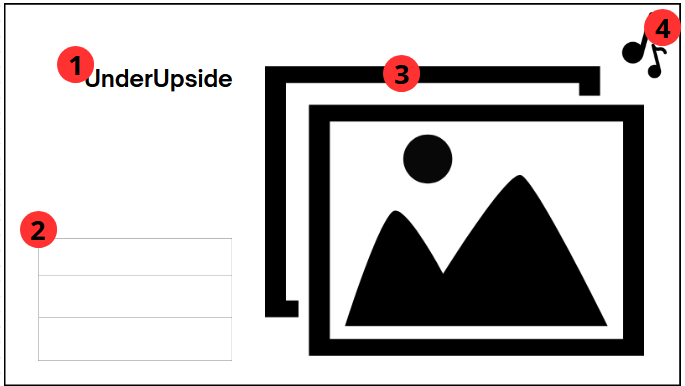
1. Título
2. VBox Container:
        Start
        Exit
1. Imagen de fondo
2. Música de fondo (Global)

- **Pantalla de juego**
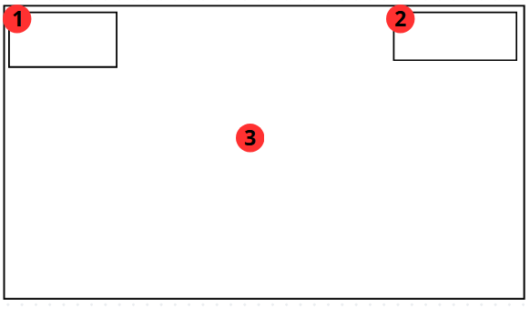

1. Contador de gorras
2. Contador de vidas
3. Escenario 2D de la partida

## ARTE

### Entorno

- **Fondo**
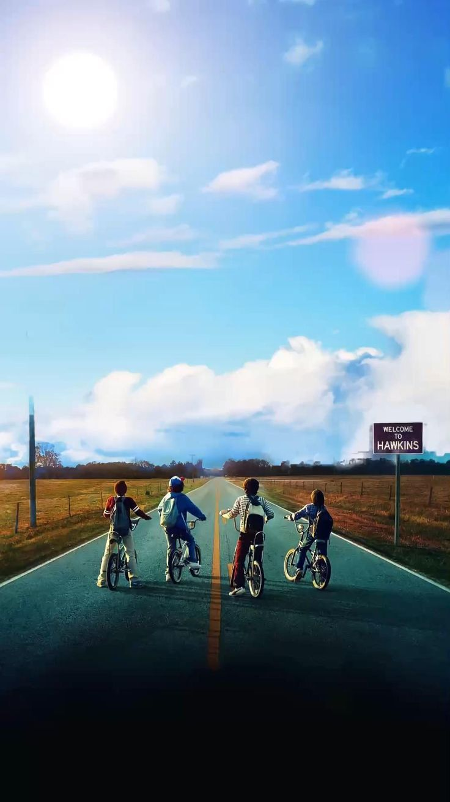
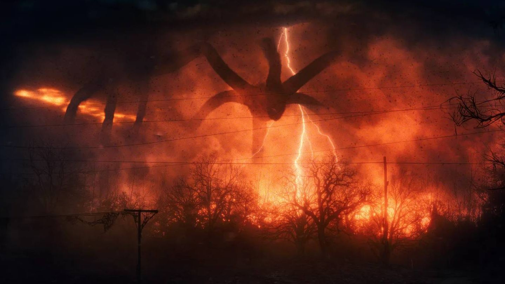

Imágenes obtenidas de internet.
He usado un Parallax Background para poder añadir las dos imágenes al fondo y, además, la imagen de UnderUpside se repite según vamos descendiendo la plataforma

- **Plataformas**
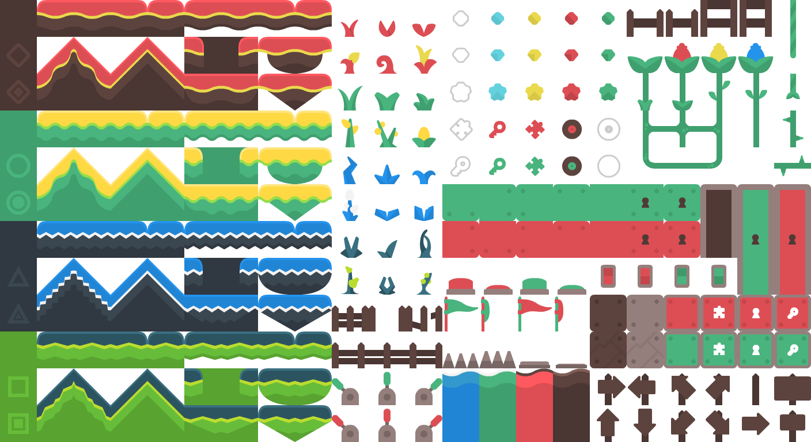
Imagen obtenida de internet

### Personajes

- **Personaje principal (Eleven)**
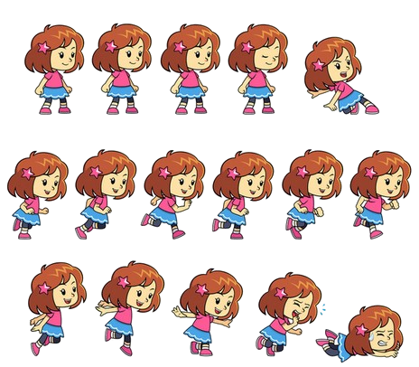
Obtenida de internet

- **Enemigo dinámico (Demogorgon)**
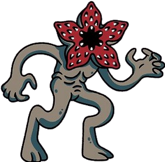
Imagen obtenida de internet. Como no he contrado ningun asset que me viniese bien, he utilizado una imagen. Le he añadido parpadeo para hacerl un poco mas dinámico

- **Enemigo estático (Mancha)**
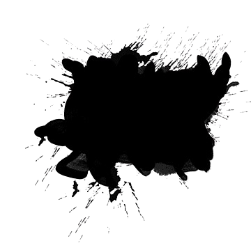
Imagen obtenida de internet

### Objetos

- **Coleccionable (Gorra)**
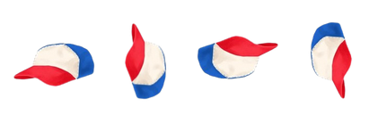
Imagen obtenida de internet y editada con un programa básico para simular el giro del objeto

### Audio
- **Musica de fondo**
Pista de música gratuita similar a la banda sonora original de la serie.
- **Sonido 'recoger gorra'**
Cuando el jugador entra en contacto con una gorra se reproduce un sonido específico
- **Sonido 'perder vida'**
Cuando el jugador entra en contacto con un enemigo (estático o dinámico) se reproduce un sonido de ‘golpe’
- **Sonido 'Game Over'**
Cuando el personaje principal pierde todas las vidas, se reproduce un audio de ‘Game Over’

## PROGRAMACIÓN
La programación del proyecto se basa en el uso de Godot Engine con GDScript para crear una experiencia interactiva y dinámica, que involucra la física del juego, la animación de los personajes, la recolección de objetos y la gestión de eventos como la muerte y la colisión. A continuación se describen los elementos clave implementados en el código.

### Jugadora
La Jugadora es un personaje principal controlado por el jugador que interactúa con el entorno, realiza saltos, y se ve afectado por la gravedad invertida y la física del movimiento.

**Gravedad Invertida**: La dirección de la gravedad cambia cuando la Jugadora está por encima de un umbral (global_position.y > 32). Este sistema de gravedad es manejado por la función apply_gravity que ajusta la velocidad de la Jugadora según la gravedad invertida.

**Movimiento**: Se usa un sistema de aceleración y fricción para manejar el movimiento del personaje (mover_izquierda, mover_derecha). Además, la Jugadora experimenta una mayor aceleración en el aire.

**Salto**: El salto se gestiona con un sistema que considera si la Jugadora está descansando (en el suelo o en el techo, dependiendo de la gravedad). El salto se ajusta dependiendo de si la gravedad está invertida.

**Animaciones**: Las animaciones de la Jugadora cambian dinámicamente según el movimiento y el estado del personaje (en el suelo, en el aire, corriendo, saltando o muriendo).

**Contadores y vidas**: El número de "gorras" que la Jugadora recoge se actualiza en una interfaz y se refleja visualmente. También se gestionan las vidas de la Jugadora y se inicia un proceso de muerte cuando las vidas llegan a cero, con una animación de muerte y el cambio de escena después de un retraso.

### Demogorgon
El Demogorgon es un enemigo que se mueve sobre una plataforma y cambia de dirección al golpear las paredes o detectar que no hay suelo.

**Movimiento y gravedad invertida**: El Demogorgon se mueve hacia un lado dependiendo de su dirección. Si la gravedad está invertida, se invierte el comportamiento de su movimiento, modificando los detectores de colisión para interactuar con el techo en lugar del suelo.

**Colisiones**: Al entrar en contacto con la Jugadora, el Demogorgon produce un audio de ataque y la Jugadora pierde una vida.

### Mancha
La Mancha es un área de daño que afecta a la Jugadora cuando entra en contacto con ella.

**Animación y tamaño**: Se crea un Tween para animar el cambio de tamaño de la Mancha de manera gradual, haciéndola expandirse durante un tiempo determinado.

**Colisiones**: Cuando la Jugadora entra en contacto con la Mancha, se activa un audio de golpe y se le resta una vida.

### Gorra
Las Gorras son objetos coleccionables que la Jugadora puede recoger al entrar en contacto con ellas.

**Animación y sonido**: Se reproduce una animación de la Gorra y un sonido cuando la Jugadora la recoge.

**Recogida y actualización de contadores**: La Gorra desaparece al ser recogida, y el contador de gorras se actualiza visualmente en la interfaz de usuario.

### Musica global
La Música Global maneja la música de fondo durante todo el juego.

**Reproducción de música**: La música de fondo se reproduce globalmente y se controla con la funcion play_music para comenzar la reproducción

### Contadores de vida y gorras
Los Contadores de Vidas y Gorras permiten mantener un seguimiento visual de las gorras recogidas y las vidas restantes.

**Actualización de vidas**: Se elimina un ítem visual de la interfaz cada vez que la Jugadora pierde una vida.

**Contador de gorras**: El contador de gorras se actualiza cada vez que la Jugadora recoge una nueva gorra.

## ASPECTOS DESTACABLES DEL DESARROLLO

### Cambio de gravedad
He implementado un sistema donde la gravedad de la jugadora se invierte cuando supera una altura específica en el eje y. Esto lo consigo verificando la posición de la jugadora: si se eleva más allá de un límite (y=32), cambio la dirección de la gravedad. De esta manera, cuando la jugadora alcanza esa altura, comienza a subir en vez de caer, creando un efecto de gravedad invertida.
Para lograr esto, en funcion de a variable gravedad_invertida, recalculo las físicas necesarias para que ‘andar por el techo’ simule ser andar en el suelo.
Para los enemigos, como hasta el momento no cambian de mundo (se desplazan siempre por la misma plataforma), la variable gravedad_invertida se establece al añadir el enemigo en la escena(@export)

### Aumento del tamaño de las manchas
Para hacer que la mancha aumente de tamaño con el tiempo, utilizo un método Tween. Este método permite animar la escala del objeto, haciendo que crezca de forma gradual hasta alcanzar el tamaño final definido. Esto se hace en un tiempo determinado para que el efecto se vea de forma suave, lo que añade dinamismo visual y hace que la mancha parezca expandirse de manera natural.

### Sonidos en las colisiones

Coleccionables: 
Cuando la jugadora entra en contacto con un coleccionable se reproduzca un determinado efecto de sonido. Además, en cuanto ocurre la colisión, el objeto desaparece y el contador de gorras se incrementa. 
Enemigos:
Cuando colisiona con un enemigo, también se reproduce un sonido específico. A parte de ello, en el contador de vidas desaparece un ítem

Esto no solo da retroalimentación visual al jugador, sino que también hace la experiencia más inmersiva al agregar un sonido que acompaña la acción.

### Música como variable global

Para gestionar la música de fondo de manera global en todo el juego, utilicé un nodo de tipo Autoload. Esto me permite mantener la música de fondo siempre activa sin necesidad de reescribir el código cada vez que cambio de escena. Así puedo cambiar la música de fondo según lo que esté ocurriendo en el juego, como al entrar en una nueva zona o nivel, y todo se maneja de manera centralizada.